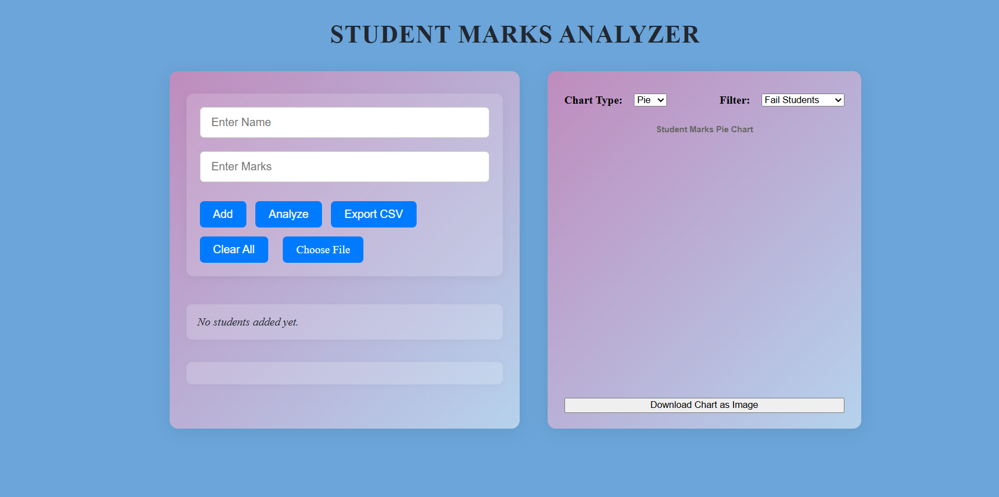

# Student Marks Analyzer

A web-based application to **manage, analyze, and visualize student marks**. Easily add, import, analyze, and export student data, and view results in interactive charts.

## Features

- **Add Student Marks:**  Manually enter student names and marks.
- **Analyze Results:**  View pass/fail status and a summary report.
- **Import CSV:**  Upload student data from CSV files.
- **Export CSV:**  Download the current student data as a CSV file.
- **Clear All:**  Remove all student data with one click.
- **Filter & Visualize:**  Filter by all students, top 10, pass, or fail students.
- **Chart Visualization:**  View data as Bar, Line, or Pie charts (powered by Chart js).
- **Download Chart:**  Save the chart as an image.
- **Responsive Design:**  Works well on desktops and laptops.

## Demo

**Live Site:** [https://student-marks.netlify.app](https://student-marks-analyzer.netlify.app/)


## Getting Started

### 1. Clone the repository

```bash
git clone https://Chandana-107//student-marks-analyzer.git
cd student-marks-analyzer
```

### 2. Open the app

You can simply open `public/index.html` in your browser.

Or use a local server (recommended for some browser features):

```bash
# Using Python 3
cd public
python -m http.server 5500
# Then open http://localhost:5500 in your browser
```

---

## Usage

1. **Add Students:**  
   Enter a name and marks, then click **Add**.

2. **Import CSV:**  
   Click **Choose File** and select a `.csv` file (format: `Name,Marks` per line).

3. **Analyze:**  
   Click **Analyze** to view a summary report.

4. **Filter & Visualize:**  
   Use the **Filter** dropdown and **Chart Type** selector to view different data and chart types.

5. **Export/Download:**  
   Use **Export CSV** to download data, or **Download Chart as Image** to save the chart.

---

## File Formats

- **CSV Import:**  
  Each line should be:  
  ```
  Name,Marks
  John Doe,85
  Jane Smith,78
  ```

---

## Technologies Used

- HTML5, CSS3 (Flexbox, Gradients)
- JavaScript (ES6+)
- [Chart.js](https://www.chartjs.org/) for charts
- FileReader API for CSV import

---

## Customization & Extensibility

- **Excel Support:**  
  To support `.xls`/`.xlsx` files, integrate [SheetJS](https://sheetjs.com/).

- **Dark Mode:**  
  Toggle dark mode for comfortable viewing.

- **More Analytics:**  
  Extend the analysis/reporting as needed.

---

## License

This project is licensed under the [MIT License](LICENSE).


---

##
